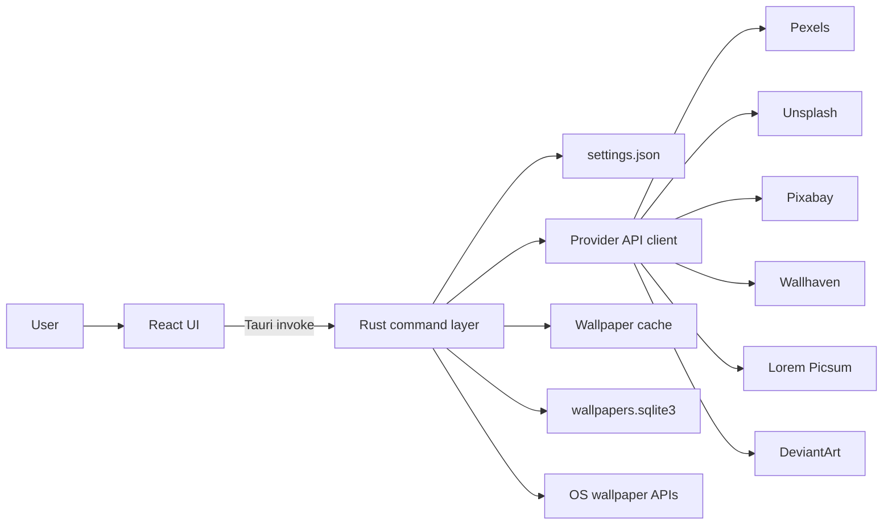
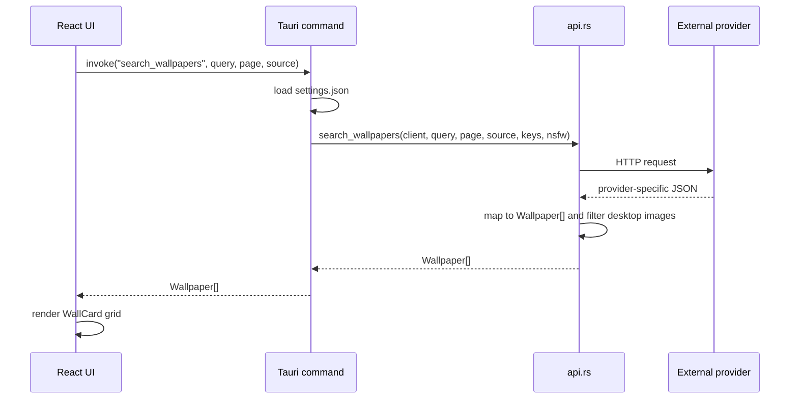
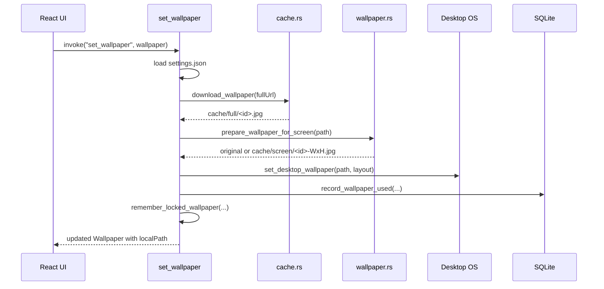

# Wallpaper Engine Architecture

This document describes the current architecture of Wallpaper Engine as of commit `78d0f8d`.

Wallpaper Engine is a desktop wallpaper manager built with a React/Vite frontend and a Tauri 2 Rust backend. The frontend owns presentation and user interaction. The Rust backend owns persistence, provider API calls, local caching, desktop wallpaper changes, and the auto-change scheduler.

## High-Level Shape



The main runtime boundary is the Tauri command interface. TypeScript calls `invoke(...)`; Rust receives typed command arguments, performs the privileged or persistent work, and returns serializable data back to the UI.

## Technology Stack

- Frontend: React 19, TypeScript, Vite, lucide-react icons.
- Desktop shell: Tauri 2.
- Backend/runtime: Rust 2021.
- HTTP client: `reqwest` with Rustls TLS.
- Database: SQLite through `rusqlite` with the bundled SQLite feature.
- Image processing: `image` crate for resizing oversized wallpapers.
- Async runtime: Tokio through Tauri async runtime.
- CI/build: GitHub Actions matrix for Windows, Linux, and macOS.

## Repository Layout

```text
.
|-- src/                         # React frontend
|   |-- App.tsx                  # App state, navigation, Tauri command calls
|   |-- types.ts                 # Shared frontend data types
|   |-- pages/                   # Home, Search, Library, Settings screens
|   |-- components/              # Reusable UI components
|   |-- searchFlow.ts            # Search/source selection UI helper
|   `-- settingsFlow.ts          # Settings input parsing helper
|-- src-tauri/
|   |-- tauri.conf.json          # Tauri app, bundle, asset protocol config
|   |-- capabilities/default.json # Main window permissions
|   |-- Cargo.toml               # Rust dependencies and crate config
|   `-- src/
|       |-- lib.rs               # Tauri setup, AppState, command handlers
|       |-- main.rs              # Native entry point
|       |-- models.rs            # Rust DTOs returned to the frontend
|       |-- settings.rs          # Settings schema and JSON persistence
|       |-- api.rs               # Provider requests and response mapping
|       |-- cache.rs             # SQLite library and file cache
|       `-- wallpaper.rs         # OS wallpaper application and resizing
|-- .github/workflows/build.yml  # Desktop bundle CI
`-- docs/                        # Project documentation
```

## Frontend Architecture

The frontend is intentionally thin. It keeps UI state in React and delegates real work to Rust commands.

### `src/App.tsx`

`App.tsx` is the frontend coordinator. It stores:

- active view: `home`, `search`, `library`, or `settings`
- loaded settings
- current wallpaper
- library data
- cache stats
- search query/source/page/results
- selected mood
- busy and notice state

On boot, `App.tsx` checks whether it is running inside Tauri. If yes, it invokes:

- `get_settings`
- `list_library`
- `cache_stats`

All commands go through a shared `runWithStatus` helper that sets a busy label, catches command errors, and surfaces messages in the UI.

### Pages

- `HomePage`: current wallpaper preview, mood buttons, trending topics, random/next/save actions.
- `SearchPage`: provider selector, search box, result grid, load more.
- `LibraryPage`: saved favorites and downloaded wallpapers from SQLite.
- `SettingsPage`: API keys, theme, layout, auto-change interval, resolution, cache limit, Wallhaven NSFW toggle, cache clear action.

### Components

- `WallCard`: renders one wallpaper result or cached wallpaper and exposes set/save actions.
- `MoodBar`: renders fixed mood chips that map to predefined search queries.

### Frontend Types

`src/types.ts` mirrors the serializable Rust models. Both sides use camelCase JSON through Serde and TypeScript interfaces, so objects can pass through Tauri without manual conversion.

## Backend Architecture

The backend is organized by responsibility:

- `lib.rs`: command layer and app lifecycle.
- `settings.rs`: user settings JSON.
- `api.rs`: provider clients and response normalization.
- `cache.rs`: metadata database and local file cache.
- `wallpaper.rs`: operating-system wallpaper operations.
- `models.rs`: shared Rust DTOs.

### AppState

`AppState` in `src-tauri/src/lib.rs` is the shared backend context managed by Tauri:

```rust
pub struct AppState {
    client: Client,
    settings_path: PathBuf,
    db_path: PathBuf,
    cache_dir: PathBuf,
    scheduler: Mutex<Option<JoinHandle<()>>>,
    wallpaper_lock: Arc<Mutex<Option<wallpaper::WallpaperLock>>>,
}
```

It centralizes:

- one reusable HTTP client
- the settings JSON path
- the SQLite database path
- the wallpaper cache directory
- the optional auto-change scheduler task
- the current wallpaper lock state

### Startup Lifecycle

On startup, Tauri runs `setup` in `lib.rs`:

1. Resolve app-specific config, data, and cache directories from Tauri path APIs.
2. Create those directories if missing.
3. Resolve `settings.json`.
4. Load settings or use defaults.
5. Create/open `wallpapers.sqlite3`.
6. Create a `wallpaper_lock` from the current desktop wallpaper when supported.
7. Start the Windows wallpaper guard.
8. Register `AppState` for command handlers.

On macOS, observed locations are:

- Settings: `~/Library/Application Support/com.puneetdixit.wallpaperengine/settings.json`
- Database: `~/Library/Application Support/com.puneetdixit.wallpaperengine/wallpapers.sqlite3`
- Cache: `~/Library/Caches/com.puneetdixit.wallpaperengine/wallpapers`

Windows and Linux use Tauri's equivalent app config, app data, and app cache directories.

## Tauri Command Interface

The frontend calls these backend commands:

| Command | Purpose |
| --- | --- |
| `get_settings` | Load saved settings or defaults. |
| `save_settings` | Sanitize and save settings, then restart the scheduler if needed. |
| `search_wallpapers` | Search a provider or merged provider set. |
| `random_wallpapers` | Fetch random/curated wallpapers from a provider or merged provider set. |
| `set_wallpaper` | Download, prepare, apply, and record one wallpaper. |
| `save_favorite` | Mark a wallpaper as a favorite in SQLite. |
| `list_library` | Return favorite and downloaded wallpaper lists. |
| `cache_stats` | Return recursive cache size and file count. |
| `clear_cache` | Remove cached files and clear stored local paths. |
| `clear_library` | Delete all wallpaper metadata. |
| `apply_random_wallpaper` | Fetch and apply a random wallpaper, with cached fallback. |

The command layer always returns `Result<T, String>` so UI errors are readable without exposing Rust error types.

## Settings Model

Settings are stored as pretty JSON in camelCase:

```json
{
  "apiKeys": {
    "pexels": "",
    "unsplash": "",
    "pixabay": "",
    "wallhaven": "",
    "deviantart": ""
  },
  "autoChangeMinutes": 0,
  "resolution": "auto",
  "cacheLimitMb": 1024,
  "allowNsfwWallhaven": false,
  "theme": "system",
  "wallpaperLayout": "fit"
}
```

`settings.rs` trims API keys, clamps `cacheLimitMb` to `128..=10240`, and clamps `autoChangeMinutes` to at most one day. `theme`, `wallpaperLayout`, and `allowNsfwWallhaven` are active runtime settings. `resolution` and `cacheLimitMb` are currently persisted and shown in the UI; cache limit enforcement and provider resolution selection are not wired into the backend yet.

## Provider API Layer

`src-tauri/src/api.rs` normalizes all provider responses into one `Wallpaper` model:

```rust
pub struct Wallpaper {
    pub id: String,
    pub source: String,
    pub thumb_url: String,
    pub full_url: String,
    pub photographer: String,
    pub width: u32,
    pub height: u32,
    pub query_used: Option<String>,
    pub local_path: Option<String>,
    pub is_favorite: bool,
}
```

Supported sources:

- Pexels: search and curated random; requires API key.
- Unsplash: search and random; requires access key.
- Pixabay: search; requires API key.
- Wallhaven: search/random; SFW works without a key, NSFW requires API key.
- Lorem Picsum: no-key placeholder source.
- DeviantArt: tag search; requires OAuth access token.
- ArtStation: deliberately unsupported because there is no stable public search API.

Provider response mappers filter results through `is_desktop_wallpaper`, which rejects small images, portrait images, and extreme aspect ratios outside `1.3..=5.5`.

For merged sources, the backend calls the enabled providers, collects successes, and returns partial results if at least one provider succeeded. It returns the joined provider errors only when every provider fails.

## Search Flow



Search is pull-based from the UI. The backend does not store search results until a wallpaper is applied or explicitly favorited.

## Wallpaper Apply Flow



The cache stores original downloads under `wallpapers/full`. On Windows, oversized images may be resized into `wallpapers/screen` to reduce the applied file to the current screen size. On non-Windows platforms, `current_screen_size` currently returns `None`, so the original cached image is used.

## Library and Cache

SQLite table:

```sql
CREATE TABLE IF NOT EXISTS wallpapers (
  id          TEXT PRIMARY KEY,
  source      TEXT NOT NULL,
  url_thumb   TEXT NOT NULL,
  url_full    TEXT NOT NULL,
  photographer TEXT NOT NULL DEFAULT '',
  width       INTEGER NOT NULL DEFAULT 0,
  height      INTEGER NOT NULL DEFAULT 0,
  local_path  TEXT,
  query_used  TEXT,
  mood        TEXT,
  is_favorite INTEGER NOT NULL DEFAULT 0,
  used_count  INTEGER NOT NULL DEFAULT 0,
  last_used   TEXT,
  created_at  TEXT NOT NULL
);
```

The database is metadata only. Image bytes live in the cache directory. Favorites and downloaded wallpapers can point to the same row. Upserts preserve favorite status and increment `used_count` when a wallpaper is applied.

`clear_cache` removes cached files and nulls `local_path` values. `clear_library` deletes all wallpaper metadata. These are separate operations because a user may want to clear bytes without losing favorite/search metadata, or clear metadata without directly managing files.

## Auto-Change Scheduler

`save_settings` restarts the scheduler after writing settings:

- `autoChangeMinutes == 0`: scheduler is stopped.
- `autoChangeMinutes > 0`: existing task is aborted and a new Tokio interval task starts.

Each timer tick calls `apply_random_wallpaper_inner` with `ApiSource::All`. That path:

1. Loads current settings.
2. Fetches random/curated wallpapers from enabled providers.
3. Applies the first returned wallpaper.
4. If every provider fails, attempts to apply a random cached wallpaper.
5. Updates the wallpaper lock when application succeeds.

The scheduler only runs while the desktop app process is running.

## OS Wallpaper Integration

`src-tauri/src/wallpaper.rs` hides platform differences:

- Windows:
  - Reads current wallpaper with `SystemParametersInfoW(SPI_GETDESKWALLPAPER)`.
  - Sets layout registry values under `HKCU\Control Panel\Desktop`.
  - Applies wallpaper with `SystemParametersInfoW(SPI_SETDESKWALLPAPER)`.
  - Starts a guard loop that checks every five seconds and restores the app wallpaper if Windows slideshow/theme changes override it.
- macOS:
  - Applies wallpaper with `osascript`: `System Events` sets every desktop picture.
  - Layout preference is accepted by the API but not applied because this path delegates to macOS.
- Linux:
  - Tries supported tools in order: `gsettings`, `swww`, `feh`, `xwallpaper`.
  - Layout preference is accepted by the API but the current fallback commands use their default fill/zoom behavior.

Unsupported operating systems return a clear error.

## Security and Permissions

The Tauri capability file grants the main window default core permissions and opener permissions. The app does not expose arbitrary filesystem APIs to the frontend.

The Tauri asset protocol is enabled for:

```json
"scope": ["$APPCACHE/wallpapers/**"]
```

That allows React to preview cached wallpaper files through `convertFileSrc` while keeping asset access scoped to the wallpaper cache.

API keys are stored locally in `settings.json`. They are not sent to the frontend except when loading settings for the Settings screen, and they are only sent over the network to the matching provider APIs by Rust.

## Build and Release Flow

Local development:

```bash
npm install
npm run tauri dev
```

Verification:

```bash
npm run build
cargo test --manifest-path src-tauri/Cargo.toml
npm run tauri build
```

GitHub Actions runs `Build desktop app` on push, pull request, and manual dispatch. The matrix builds:

- Windows: `windows-latest`, artifact `wallpaper-engine-windows`
- Linux: `ubuntu-22.04`, artifact `wallpaper-engine-linux`
- macOS: `macos-latest`, artifact `wallpaper-engine-macos`

Each job checks out the repo, installs Node 22, installs stable Rust, caches Rust dependencies, builds the frontend, runs Rust tests, builds the Tauri bundle, and uploads `src-tauri/target/release/bundle/**`.

## Testing Strategy

Current automated coverage focuses on backend logic and small frontend helpers:

- Settings load/save/defaults/clamping.
- Provider response mapping and provider-specific validation.
- SQLite favorite/download/cache behavior.
- Wallpaper layout values, Linux command construction, image resizing, and wallpaper lock behavior.
- Tauri asset protocol config.
- Frontend helper tests for settings parsing and search source behavior.

There is no full end-to-end UI test in the current tree. Manual verification is still useful for provider API calls, OS wallpaper behavior, and bundled app installation.

## Extension Points

Common changes should fit these boundaries:

- Add a provider:
  1. Add source value to `src/types.ts` and `src-tauri/src/models.rs`.
  2. Add frontend source option in `SearchPage`.
  3. Add API key field if needed in `ApiKeys`, settings UI, and settings tests.
  4. Add fetch and map functions in `api.rs`.
  5. Wire the provider into `search_wallpapers` and `random_wallpapers`.

- Add a setting:
  1. Add it to TypeScript `AppSettings`.
  2. Add it to Rust `AppSettings` with Serde camelCase handling.
  3. Add defaults and sanitization if needed.
  4. Add Settings UI controls.
  5. Consume it in the relevant backend command.

- Add a wallpaper platform backend:
  1. Add a target-specific `set_platform_wallpaper` branch in `wallpaper.rs`.
  2. Add command construction helpers where possible.
  3. Add unit tests for generated commands or layout values.

## Current Architectural Constraints

- The backend is the source of truth for provider calls, persistence, cache files, and OS wallpaper changes.
- The frontend should not directly call provider APIs or touch local files outside Tauri commands.
- Search results are transient until favorited or applied.
- The scheduler is process-local; it does not run after the app exits.
- Cached file previews depend on Tauri's scoped asset protocol.
- `resolution` and `cacheLimitMb` are stored but not fully enforced in provider fetch or cache eviction logic yet.
