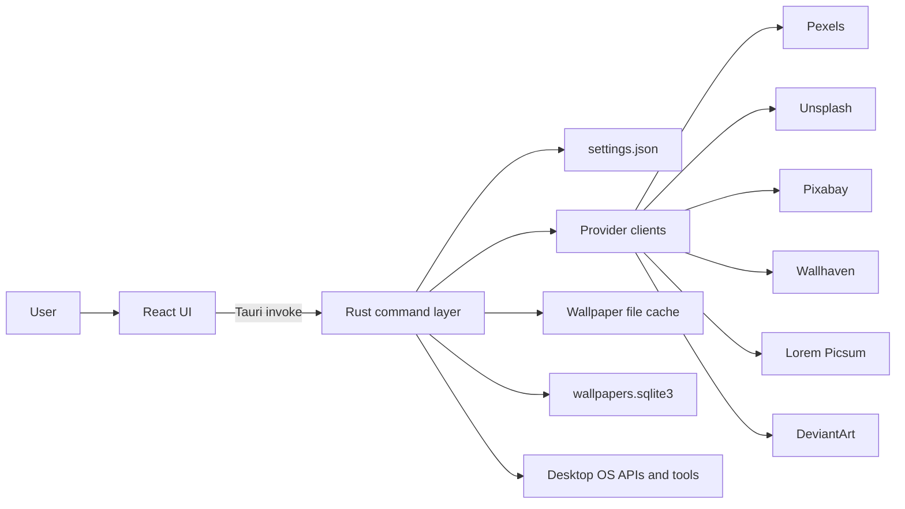
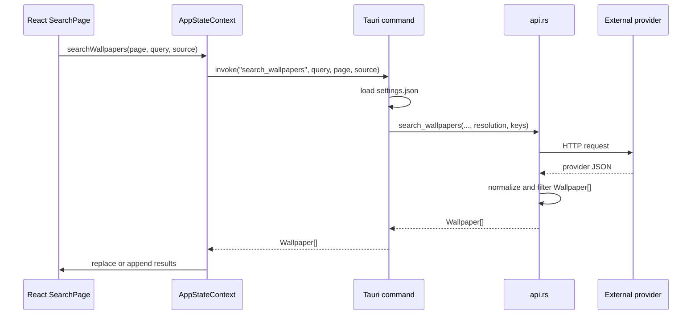
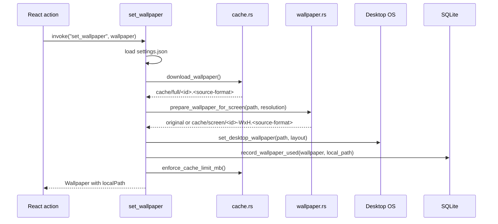

# Wallpaper Engine Architecture

This document describes the current architecture of Wallpaper Engine. The app is a Tauri 2 desktop application with a React/Vite frontend and a Rust backend. React owns presentation and interaction state. Rust owns provider API calls, settings persistence, SQLite metadata, file caching, image preparation, desktop wallpaper operations, and the auto-change scheduler.

## High-Level System



The frontend never calls wallpaper providers directly and never touches arbitrary local files. It uses Tauri commands as the only privileged boundary.

## Technology Stack

- Frontend: React 19, TypeScript, Vite, lucide-react.
- Desktop shell: Tauri 2.
- Backend: Rust 2021.
- HTTP: `reqwest` with Rustls TLS.
- Persistence: JSON settings plus SQLite through `rusqlite`.
- Image processing: `image` crate with JPEG, PNG, and WebP support.
- Async runtime: Tokio through Tauri.
- Verification: Vitest for TypeScript helpers/component render states, Rust unit tests for backend behavior.

## Repository Layout

```text
.
|-- src/
|   |-- App.tsx                  # Root shell, sidebar, theme resolution
|   |-- appState.tsx             # React reducer, context, Tauri action wrappers
|   |-- types.ts                 # Frontend DTOs and settings types
|   |-- pages/                   # Home, Search, Library, Settings views
|   |-- components/              # Wall cards, empty states, skeletons, error boundary
|   |-- searchFlow.ts            # Source-selection helper
|   |-- settingsFlow.ts          # Settings input parsing helpers
|   |-- wallpaperSelection.ts    # Random wallpaper/mood selection helpers
|   `-- themePreference.ts       # System/light/dark theme resolution
|-- src-tauri/
|   |-- tauri.conf.json          # Window, bundle, asset protocol, CSP
|   |-- capabilities/default.json
|   |-- Cargo.toml
|   `-- src/
|       |-- lib.rs               # Tauri setup, commands, scheduler
|       |-- models.rs            # Rust DTOs
|       |-- settings.rs          # Settings schema and sanitization
|       |-- api.rs               # Provider clients and normalizers
|       |-- cache.rs             # SQLite metadata and file cache
|       `-- wallpaper.rs         # OS wallpaper integration and image resizing
|-- docs/ARCHITECTURE.md
`-- .github/workflows/build.yml
```

## Frontend Architecture

The frontend state is centralized in `src/appState.tsx` using `useReducer` plus `AppStateContext`. Pages consume context directly instead of receiving large prop bundles from `App.tsx`.

### State Model

`AppState` contains:

| Field | Purpose |
| --- | --- |
| `activeView` | Current view: `home`, `search`, `library`, or `settings`. |
| `settings` | Loaded and sanitized app settings. |
| `currentWallpaper` | Wallpaper most recently applied through the UI. |
| `library` | Favorites and downloaded wallpapers from SQLite. |
| `cacheStats` | Recursive cache size and file count. |
| `query` / `source` | Current search request state. |
| `mood` | Active mood category. |
| `results` / `page` | Search result list and current page. |
| `busy` | Loading/action identifier such as `search` or `set-<id>`. |
| `notice` | User-visible success or error message. |

Derived context values include `hasAnyKey` and `favoriteIds`.

### Action Layer

Context actions wrap Tauri commands with a common `runWithStatus` flow:

1. Set the `busy` label and clear the old notice.
2. Reject wallpaper actions outside the Tauri runtime with a clear message.
3. Invoke the backend command.
4. Store success messages or command errors.
5. Refresh library/cache state after mutations.

Important actions:

- `searchWallpapers`: invokes `search_wallpapers`; page 1 replaces results and later pages append.
- `applyMood`: picks a random query from the selected mood and searches it.
- `applyNextFromMood`: picks a random mood query, fetches page 1, then applies a random returned wallpaper.
- `setWallpaper`: downloads, prepares, applies, records, and refreshes state.
- `saveSettings`: saves sanitized settings and restarts the backend scheduler.

### View Composition

`App.tsx` owns only the shell:

- Theme resolution for `system`, `light`, and `dark`.
- Sidebar navigation.
- Error boundary wrapper.
- Current page selection.

Pages:

- `HomePage`: current preview, provider status, mood chips, trending topics, random/next/save actions.
- `SearchPage`: source selector, search box, grid, loading skeletons, empty state, and infinite scroll sentinel.
- `LibraryPage`: favorite and downloaded sections with empty states and a confirmation before clearing metadata.
- `SettingsPage`: API keys, theme, layout, auto-change interval, resolution, cache limit, NSFW toggle, save, and cache clear confirmation.

Components:

- `WallCard`: preview thumbnail, set action, favorite action with filled heart for saved wallpapers.
- `FallbackImage`: replaces broken images with a structured fallback.
- `WallGridSkeleton`: shimmer placeholders during searches.
- `EmptyState`: shared blank-state UI.
- `ErrorBoundary`: render-crash fallback for the app shell.
- `MoodBar`: fixed mood selector.

## Backend Architecture

The backend is split by responsibility:

| Module | Responsibility |
| --- | --- |
| `lib.rs` | Tauri setup, command handlers, scheduler, wallpaper lock state. |
| `settings.rs` | Settings defaults, load/save, and sanitization. |
| `api.rs` | Provider request construction, response parsing, result filtering. |
| `cache.rs` | SQLite schema, upserts, library queries, cache stats, eviction. |
| `wallpaper.rs` | Screen sizing, image resizing, OS wallpaper commands. |
| `models.rs` | Serde DTOs shared across commands. |

### Backend AppState

```rust
pub struct AppState {
    client: Client,
    settings_path: PathBuf,
    db_path: PathBuf,
    cache_dir: PathBuf,
    scheduler: Mutex<Option<JoinHandle<()>>>,
    wallpaper_lock: Arc<Mutex<Option<wallpaper::WallpaperLock>>>,
}
```

The `reqwest::Client` is reused. SQLite still opens short-lived connections per operation, but schema creation is guarded by an init-once registry so `CREATE TABLE IF NOT EXISTS` is not rerun for every command.

## Settings

Settings are stored as pretty JSON with camelCase keys:

```json
{
  "apiKeys": {
    "pexels": "",
    "unsplash": "",
    "pixabay": "",
    "wallhaven": "",
    "deviantart": ""
  },
  "autoChangeMinutes": 0,
  "resolution": "auto",
  "cacheLimitMb": 1024,
  "allowNsfwWallhaven": false,
  "theme": "system",
  "wallpaperLayout": "fit"
}
```

Sanitization:

- API keys are trimmed.
- `autoChangeMinutes` is clamped to `0..=1440`.
- `cacheLimitMb` is clamped to `128..=10240`.

Runtime effects:

- `theme` controls frontend light/dark/system rendering.
- `wallpaperLayout` controls platform-specific layout commands.
- `autoChangeMinutes` controls scheduler lifecycle.
- `resolution` changes provider filtering and Wallhaven `atleast` values, and is used as a fallback screen size for resizing.
- `cacheLimitMb` is enforced after downloads by evicting least-recently-used cached wallpapers.
- `allowNsfwWallhaven` enables NSFW Wallhaven purity only when a Wallhaven key is also present.

## Provider Layer

`api.rs` normalizes providers into the Rust `Wallpaper` model:

```rust
pub struct Wallpaper {
    pub id: String,
    pub source: String,
    pub thumb_url: String,
    pub full_url: String,
    pub photographer: String,
    pub width: u32,
    pub height: u32,
    pub query_used: Option<String>,
    pub mood: Option<String>,
    pub local_path: Option<String>,
    pub is_favorite: bool,
}
```

Supported `ApiSource` values are `all`, `pexels`, `unsplash`, `pixabay`, `wallhaven`, `picsum`, `deviantArt`, and `artStation`. The old dead `both` source has been removed. `artStation` remains a typed value but returns an explicit unsupported error because there is no stable public search API.

Provider behavior:

- Pexels: search and curated random; requires API key.
- Unsplash: search and random; requires access key.
- Pixabay: search; requires API key.
- Wallhaven: search/random; SFW works without a key, NSFW requires API key and setting opt-in.
- Lorem Picsum: no-key fallback source.
- DeviantArt: tag search with full multi-word query support; requires OAuth token.

For `ApiSource::All`, enabled providers are fetched concurrently with `tokio::join!`. Results are merged from successful providers. If every provider fails, the joined errors are returned.

Result filtering rejects small images, portrait images, and extreme aspect ratios. The minimum dimensions depend on `resolution`: automatic defaults are permissive, Full HD requires `1920x1080`, and 4K requires `3840x2160`. Wallhaven receives matching `atleast` parameters.

## Search Flow



Search results are transient. A wallpaper is persisted only when it is favorited or applied.

## Apply Flow



Downloads preserve supported image extensions from the URL or HTTP content type. Resized screen-cache images preserve JPEG, PNG, or WebP format when supported. JPEG resize output is converted to RGB for compatibility.

## Library, Cache, and Metadata

SQLite table:

```sql
CREATE TABLE IF NOT EXISTS wallpapers (
  id          TEXT PRIMARY KEY,
  source      TEXT NOT NULL,
  url_thumb   TEXT NOT NULL,
  url_full    TEXT NOT NULL,
  photographer TEXT NOT NULL DEFAULT '',
  width       INTEGER NOT NULL DEFAULT 0,
  height      INTEGER NOT NULL DEFAULT 0,
  local_path  TEXT,
  query_used  TEXT,
  mood        TEXT,
  is_favorite INTEGER NOT NULL DEFAULT 0,
  used_count  INTEGER NOT NULL DEFAULT 0,
  last_used   TEXT,
  created_at  TEXT NOT NULL
);
```

The database stores metadata only. Image bytes live under the app cache directory:

- `wallpapers/full`: original downloaded files.
- `wallpapers/screen`: resized files prepared for the detected or configured screen size.

`mood` is populated when a wallpaper comes from a mood flow, so future features can filter history by mood. Upserts preserve favorite status and preserve existing `query_used`/`mood` values when an incoming update omits them.

Cache eviction runs after every wallpaper download/apply. It compares recursive cache bytes to `cacheLimitMb`, removes least-recently-used DB-backed cached files first using `last_used`, nulls their `local_path`, and then removes oldest stray cache files if the cache is still over the limit.

`clear_cache` removes cached files and nulls local paths. `clear_library` deletes all wallpaper metadata. Both frontend actions require confirmation.

## Scheduler

`save_settings` restarts the scheduler after settings are written:

- `autoChangeMinutes == 0`: scheduler is stopped.
- `autoChangeMinutes > 0`: old task is aborted and a new interval task starts.

The scheduler uses `tokio::time::interval_at(now + interval, interval)`, so saving settings does not immediately change the wallpaper. Each tick applies a random wallpaper from `ApiSource::All`, using cached fallback only if every provider fails.

The scheduler is process-local. It runs only while the app process is alive.

## Platform Support Matrix

| Capability | Windows | macOS | Linux |
| --- | --- | --- | --- |
| Set wallpaper | `SystemParametersInfoW` | `osascript` / System Events | `gsettings`, `swww`, `feh`, or `xwallpaper` |
| Layout support | Fill, Fit, Stretch, Tile, Center, Span via registry | Tile toggles picture rotation; other layouts use macOS scaling behavior | GNOME `picture-options` plus tool-specific flags |
| Screen size detection | `GetSystemMetrics` | Finder desktop bounds via `osascript` | `xrandr --current`, fallback `xdpyinfo` |
| Resize before apply | Yes | Yes when screen size is detected or resolution fallback is set | Yes when screen size is detected or resolution fallback is set |
| Current wallpaper detection | `SPI_GETDESKWALLPAPER` | System Events desktop picture | GNOME `picture-uri` |
| Wallpaper guard loop | Yes | No | No |

Unsupported operating systems return a clear error for wallpaper changes.

## Security and Permissions

The frontend has only the Tauri permissions declared in `capabilities/default.json`. It does not receive a general filesystem API.

Tauri asset protocol is scoped to:

```json
"scope": ["$APPCACHE/wallpapers/**"]
```

This allows cached previews through `convertFileSrc` without exposing arbitrary files.

The Tauri CSP is non-null and restricts the app shell:

- `default-src 'self'`
- `script-src 'self'`
- `style-src 'self' 'unsafe-inline'` for bundled CSS/runtime style needs
- `img-src 'self' asset: http://asset.localhost https: data:` for local cache previews and provider thumbnails
- `connect-src 'self' ipc: http://ipc.localhost https:` for Tauri IPC and provider requests

API keys are stored locally in `settings.json`. They are loaded into the Settings screen and sent only by Rust to the matching provider APIs.

## Build and Verification

Local development:

```bash
npm install
npm run tauri dev
```

Core verification:

```bash
npm test
npm run build
cargo test --manifest-path src-tauri/Cargo.toml
```

Release packaging:

```bash
npm run tauri build
```

GitHub Actions builds Windows, Linux, and macOS bundles and uploads release artifacts from `src-tauri/target/release/bundle/**`.

## Testing Coverage

Current automated coverage includes:

- Frontend reducer behavior, destructive confirmation helper, theme resolution, search/settings helpers, random mood/wallpaper selection, and server-rendered empty/skeleton/favorite states.
- Provider mapping, filtering, Wallhaven purity/resolution behavior, DeviantArt multi-word tags, and concurrent merged provider behavior.
- Settings defaults, sanitization, and persistence.
- SQLite favorite/download/library behavior, mood persistence, init-once schema tracking, cache stats, and LRU eviction.
- OS command construction, layout mapping, screen-size fallback, current-wallpaper parsing, image resizing, image format preservation, and wallpaper lock behavior.
- Tauri asset protocol and CSP configuration.

## Known Limitations

- No full end-to-end UI automation is checked in yet.
- Provider API rate limiting and retries are not implemented.
- ArtStation remains unsupported because there is no stable public search API.
- The wallpaper guard loop currently runs only on Windows, even though macOS/Linux can read current wallpaper paths.
- Linux wallpaper behavior depends on installed desktop tools and desktop environment support.
- SQLite uses short-lived connections rather than a full connection pool.

## Extension Points

Add a provider:

1. Add the source value to `src/types.ts` and `src-tauri/src/models.rs`.
2. Add a source option in `SearchPage`.
3. Add API key fields if needed in settings types, UI, and tests.
4. Add fetch and mapper functions in `api.rs`.
5. Wire the provider into `search_wallpapers` and `random_wallpapers`.

Add a setting:

1. Add it to frontend `AppSettings`.
2. Add it to Rust `AppSettings` with Serde camelCase support.
3. Add defaults and sanitization.
4. Add Settings UI controls.
5. Consume it in the relevant backend command.

Add a platform wallpaper backend:

1. Add a target-specific branch in `wallpaper.rs`.
2. Keep command construction in testable helper functions.
3. Add tests for generated commands, layout values, and parsing behavior.
